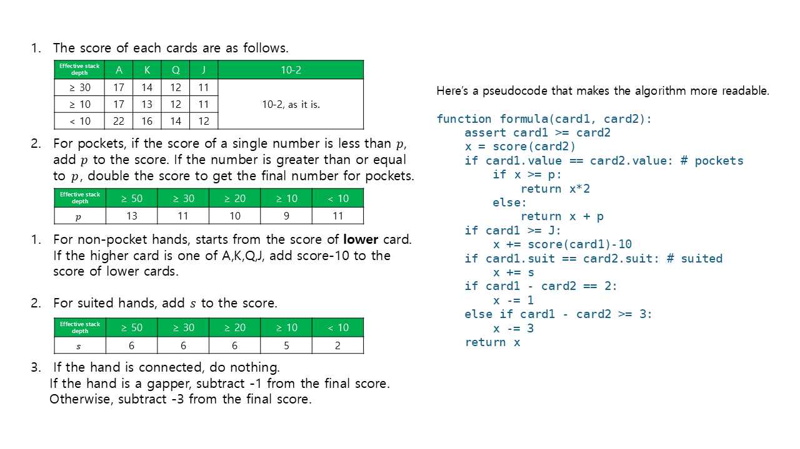
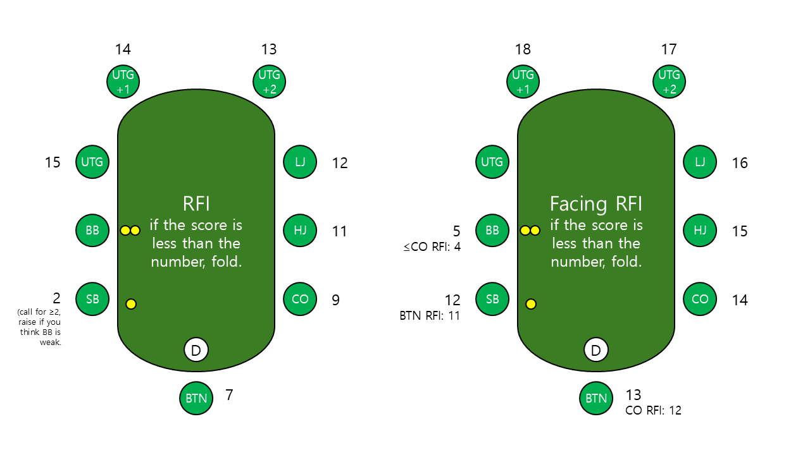

# Reinventing Chen Formula for MTT GTO Preflop

## Introduction

When I first learned Texas Hold'em, the Chen formula was one of the most useful tools for me.
It assigns a numerical score to each hand based on high cards, suitedness, and connectedness, and maps hands into a single value. This makes it easier to categorize hands similarly to Sklansky’s hand groups.

Before I discovered GTO preflop charts, the Chen formula helped me:
- distinguish premium hands from junk hands
- decide whether to enter the pot or fold

If you're unfamiliar with the Chen formula, here is a good reference:
https://www.thepokerbank.com/strategy/basic/starting-hand-selection/chen-formula/

However, Chen formula has clear limitations:

- It originates from limit Hold’em, which is no longer the dominant format
- It does not account for stack depth
- It assumes linear hand strength, while modern poker often uses polarized ranges
- It fails to capture nuances like:
  - suited connector value changes with stack depth
  - Ace-high hands behaving differently in short vs deep stacks

Despite these flaws, I still find the idea of scoring hands appealing — especially for constructing *linear ranges*.

Let’s be honest:
memorizing full GTO preflop charts across all positions and stack depths is unrealistic for many players.

So the motivation of this project is:

> Can we compress GTO preflop decisions into a simplified scoring formula?

---

## Idea

There is a general consensus that:
- RFI (Raise First In) charts are useful
- Facing RFI decisions (fold/call) are also highly structured

Even though some actions (like 3-bets) are polarized,
the **fold vs not-fold boundary is mostly linear**.

So the idea is:

> Modify the Chen formula to account for stack depth and approximate GTO preflop decisions in MTT.

Scope of this project:
- RFI decisions
- Facing RFI: fold vs continue

Excluded:
- 3-bet / 4-bet strategy (too opponent-dependent)
- SB-specific strategy
- postflop play

---

## Method

### 1. Data Collection

Preflop charts were scraped from **GTO Wizard** for MTT.

Stack depth buckets:
- 80bb → represents 100–50bb
- 40bb → represents 50–30bb
- 25bb → represents 30–20bb
- 15bb → represents 20–10bb
- 5bb → represents <10bb

---

### 2. Reformulating Chen Formula

The original Chen formula was modified with the following ideas:

- Start scoring from **low cards instead of high cards**
- Adjust weights dynamically based on stack depth:
  - high card value
  - suitedness
  - connectedness
- Introduce tunable parameters (unknown variables)

---

### 3. Objective Function

To evaluate the formula, define a loss function:

> Loss = number of mismatched hands
> between:
> - hands selected by the formula (above threshold)
> - actual GTO preflop charts

Total hand space = 169 combinations

---

### 4. Optimization

Two approaches were tested:

- Logistic Regression → not suitable (continuous model, poor fit)
- **Genetic Algorithm → chosen approach**

Reason:
- problem is inherently **discrete / combinatorial**
- thresholds and scoring behave like integer optimization

The Genetic Algorithm optimizes:
- scoring weights
- decision thresholds

---

### 5. Simplification

After optimization:
- parameters were simplified for memorization
- small accuracy loss was accepted for usability

---

## Result

- Average error: **~8.19 hands out of 169 per situation**

Given:
- solver outputs vary
- real games are not GTO-perfect

This level of approximation is considered acceptable.

---

## Usage

This formula is intended as a **rough guideline** for:

- RFI decisions
- Facing RFI → fold vs continue

It does **NOT** cover:

- SB strategy
- 3-bet / 4-bet ranges
- exploitative adjustments

---

## Thoughts

- Will I use this in tournaments?
  → *Maybe.*

- Should beginners learn it?
  → *Yes, as a stepping stone.*

- Should advanced players use it?
  → *No — understanding ranges is far superior.*

---

## Disclaimer

This is an experimental project by a low-stakes player.

It is **not** meant to replace GTO study or solver work.

If you think this approach is flawed — you're probably right.
That’s not the point.

The goal is:

> to explore whether complex GTO knowledge can be compressed into a usable heuristic.

---

## Feedback

Constructive ideas for improvement are welcome.

If you have suggestions to improve this "reinvented Chen formula", feel free to contribute.